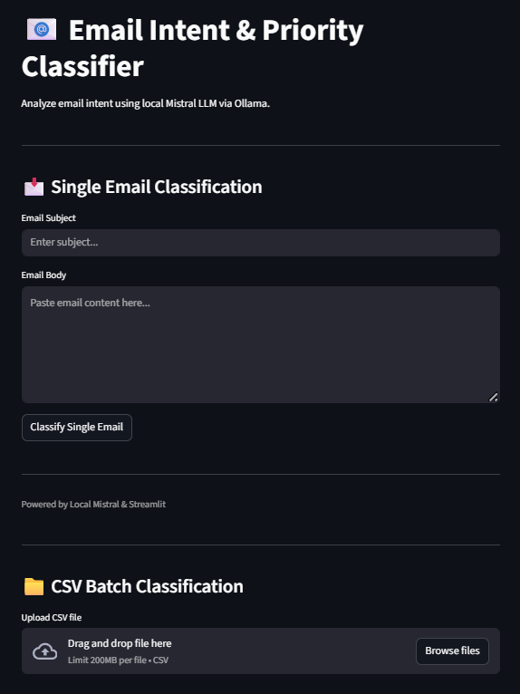
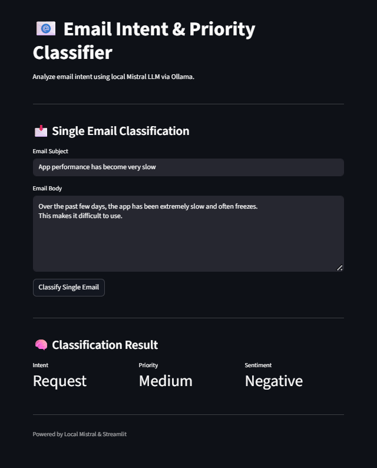
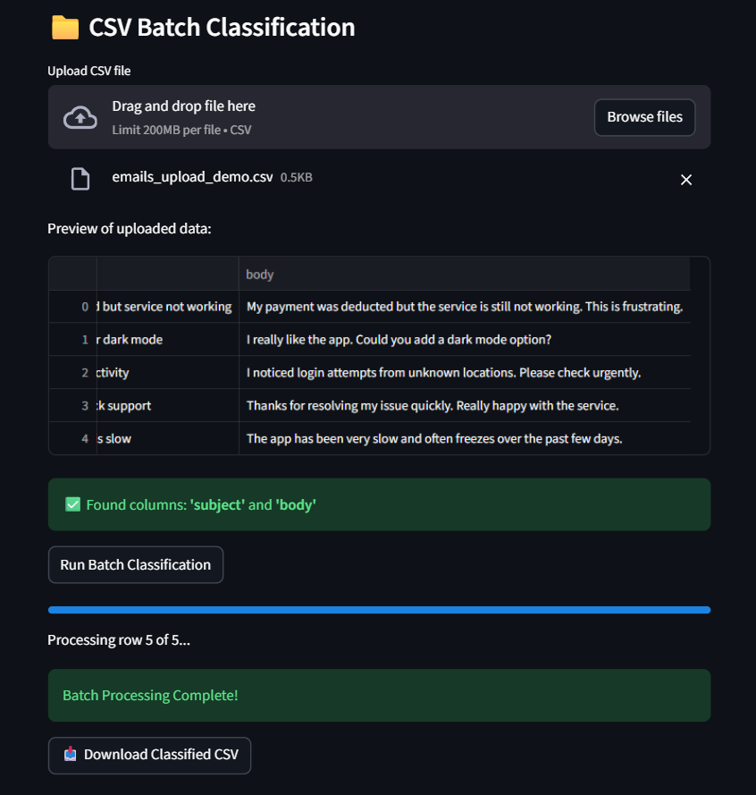
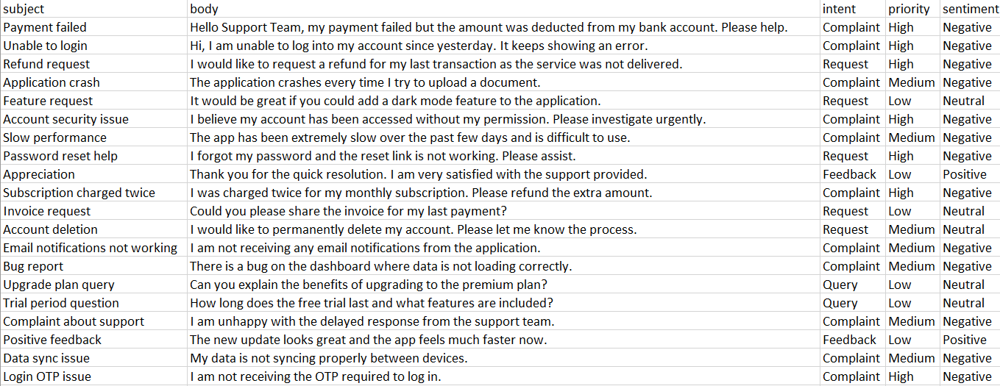

# Email Intent Classification System

An intelligent email classification system that analyzes customer emails and automatically predicts **intent**, **priority**, and **sentiment** using Large Language Models (LLMs). The project includes both a command-line workflow and an interactive Streamlit application for single and batch email classification.

---

## Overview

Customer support teams receive hundreds of emails every day. Manually categorizing these emails is time-consuming and inconsistent.

This project automates that process by classifying emails into:

- Intent (Complaint, Request, Query, Feedback, Other)
- Priority (High, Medium, Low)
- Sentiment (Positive, Neutral, Negative)

The system supports both individual email classification and batch processing for larger datasets.

---

## Features

- Intelligent email classification using OpenAI LLMs
- Single email prediction
- Batch email processing
- Interactive Streamlit web application
- CSV import and prediction export
- Modular and maintainable code structure
- Evaluation utilities for prediction analysis

---

## Tech Stack

- Python
- OpenAI API
- Streamlit
- Pandas
- NumPy
- Git

---

## Project Structure

```text
email-intent-classification-system
│
├── app/
│   └── app.py
│
├── data/
│
├── src/
│   ├── classify_batch.py
│   ├── evaluate.py
│   ├── explore_data.py
│   ├── llm_client.py
│   └── single_email_classifier.py
│
├── requirements.txt
├── .gitignore
└── README.md
```

---

## Getting Started

Clone the repository

```bash
git clone https://github.com/sinci2573/email-intent-classification-system.git
cd email-intent-classification-system
```

Install dependencies

```bash
pip install -r requirements.txt
```

Create a `.env` file

```env
OPENAI_API_KEY=your_api_key_here
```

Run the Streamlit application

```bash
streamlit run app/app.py
```

---

## Sample Output

The model predicts:

- Intent
- Priority
- Sentiment

for every email and displays the results through the Streamlit interface or exports them as CSV files during batch processing.

---

## Future Improvements

- Fine-tuned transformer models
- Multi-language email support
- Confidence score prediction
- Email summarization
- REST API deployment
- Docker containerization

---

## Screenshots

### Home


### Single Email Classification


### Batch Classification


### Prediction Results


## Author

**Sinchana Suresh Ganiga**

Software Development Engineer | AI/ML Enthusiast | Data Engineering


